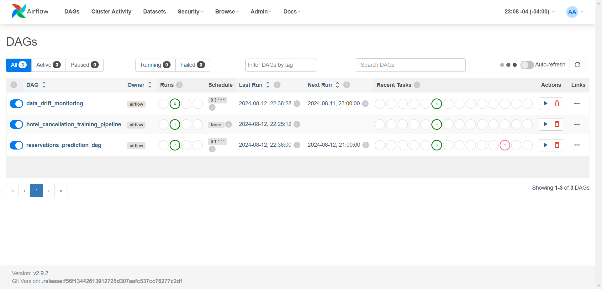

# Hotel Booking Demand Forecasting - MLOps Project


## Table of Contents
1. [Overview](#overview)
2. [Dataset Information](#dataset-information)
3. [Technical Structure](#technical-structure)
4. [Prerequisites](#prerequisites)
5. [Deployment Guide](#deployment-guide)
   - [Local Environment Setup](#local-environment-setup)
   - [Cloud Deployment with Terraform](#cloud-deployment-with-terraform)
6. [License](#license)

## Overview
In the tourism and travel-related industries, accurate demand forecasting is crucial for maximizing revenue and optimizing operations. Traditionally, most of the research in Revenue Management has focused on the aviation sector, utilizing the Passenger Name Record (PNR) format. However, other segments like hospitality, cruising, and theme parks have unique characteristics that cannot be fully addressed using aviation-specific data. 

To bridge this gap, we provide two hotel datasets that contain rich demand data, particularly useful for predicting the likelihood of a hotel booking being canceled. By accurately predicting cancellations, hotels can optimize their booking strategies, reduce no-show rates, and improve revenue management. Additionally, these datasets can be used for a variety of other predictive modeling tasks, such as forecasting occupancy rates, optimizing pricing strategies, and understanding customer booking behaviors.

One of the key challenges in building reliable prediction models is preventing data leakage, where future information inadvertently influences the model's predictions. To mitigate this, the data was collected in a manner that ensures the target variable's timestamp occurs after the input variables’ timestamp. Specifically, instead of extracting variables directly from the bookings database, the data was sourced from the bookings change log, with each variable's value reflecting the state as of the day before the arrival date.

## Dataset Information
The dataset used in this project is publicly available on Kaggle: [Hotel Booking Demand Dataset](https://www.kaggle.com/datasets/jessemostipak/hotel-booking-demand/data). The original research article providing further details can be accessed here: [Original Article](https://www.sciencedirect.com/science/article/pii/S2352340918315191).

### Column Descriptions
- `hotel`: Type of hotel (Resort Hotel or City Hotel).
- `is_canceled`: Whether the booking was canceled (1) or not (0).
- `lead_time`: Number of days between the booking date and the arrival date.
- `arrival_date_year`: Year of arrival date.
- `arrival_date_month`: Month of arrival date.
- `arrival_date_week_number`: Week number of arrival date.
- `arrival_date_day_of_month`: Day of arrival date.
- `stays_in_weekend_nights`: Number of weekend nights (Saturday or Sunday) the guest stayed or booked to stay at the hotel.
- `stays_in_week_nights`: Number of weeknights (Monday to Friday) the guest stayed or booked to stay at the hotel.
- `adults`: Number of adults.
- `children`: Number of children.
- `babies`: Number of babies.
- `meal`: Type of meal booked.
- `country`: Country of origin of the guest.
- `market_segment`: Market segment designation.
- `distribution_channel`: Booking distribution channel.
- `is_repeated_guest`: Whether the guest is a repeated guest (1) or not (0).
- `previous_cancellations`: Number of previous bookings that were canceled by the customer prior to the current booking.
- `previous_bookings_not_canceled`: Number of previous bookings not canceled by the customer prior to the current booking.
- `reserved_room_type`: Code of room type reserved.
- `assigned_room_type`: Code for the type of room assigned to the booking.
- `booking_changes`: Number of changes/amendments made to the booking.
- `deposit_type`: Indication on if the customer made a deposit to guarantee the booking.
- `agent`: ID of the travel agency that made the booking.
- `company`: ID of the company/entity that made the booking.
- `days_in_waiting_list`: Number of days the booking was in the waiting list before it was confirmed to the customer.
- `customer_type`: Type of customer, assuming one of four categories.
- `adr`: Average Daily Rate as defined by dividing the sum of all lodging transactions by the total number of staying nights.
- `required_car_parking_spaces`: Number of car parking spaces required by the customer.
- `total_of_special_requests`: Number of special requests made by the customer (e.g., twin bed or high floor).
- `reservation_status`: Reservation status (Canceled, Check-Out, or No-Show).
- `reservation_status_date`: Date at which the last status was set.

## Technical Structure
This project is built using the following technologies:
- **MLflow**: Employed for tracking experiments, versioning models, and serving the final model.

   MLflow Experiment Tracking | MLflow Model Versioning
   --- | ---
   | 

- **Apache Airflow**: Used for orchestrating and automating data pipelines.

   

- **PostgreSQL**: Serves as the metadata database for Airflow, MLflow, and tracking predictions and logs.

   

- **PgAdmin**: Provides a web-based interface for PostgreSQL database administration.
- **Evidently**: A tool for monitoring data and model performance to ensure consistent and reliable predictions over time.
- **Grafana**: Used for creating dashboards to visualize metrics and monitoring data from Evidently and other sources.

   

## Prerequisites
Before deploying the project, the following prerequisites are necessary:

- Docker and Docker Compose: For running the containerized environment.
- An AWS account: To access AWS services such as AWS EC2, AWS S3 and AWS RDS.
- Terraform: For automating the deployment of cloud resources.
- Familiarity with CLI operations: As the deployment and interaction with the project are largely conducted through the command line.

## Deployment Guide

### Local Environment Setup
1. **Clone the Repository**:
   ```bash
   git clone https://github.com/JorgeAbrego/hotel-booking-mlops-project.git
   cd hotel-booking-mlops-project
   ```
2. **Create .env file**:
   Rename `example.env` to `.env` and replace the values with your own.
   ```bash
   move .env.example .env
   nano .env
   ```

3. **Setup Docker**:
   - Ensure Docker is installed on your local machine.
   - Build and start the Docker containers:
     ```bash
     docker-compose up -d --build
     ```

4. **Access Services**:
   - MLflow will be available at `http://localhost:5000`.
   - Airflow can be accessed at `http://localhost:8080`.
   - PgAdmin can be accessed at `http://localhost:8888`.
   - Minio can be accessed at `http://localhost:9001`.
   - Grafana will be accessible at `http://localhost:3000`.

### Cloud Deployment with Terraform
1. **Install Terraform**:
   - Follow the instructions on the [official Terraform website](https://www.terraform.io/downloads) to install Terraform on your local machine.

2. **Configure Cloud Provider**:
   - Set up your AWS credentials and configure them using Terraform. Ensure your provider configuration is correctly set in `main.tf`.

3. **Deploy Infrastructure**:
   - Initialize Terraform:
     ```bash
     terraform init
     ```
   - Apply the Terraform configuration to deploy the infrastructure:
     ```bash
     terraform apply
     ```
   - Confirm the deployment when prompted.

4. **Access Cloud Services**:
   - After deployment, Terraform will output the URLs and access credentials for the deployed services (MLflow, Airflow, PGAdmin, etc.).

## License
This project is licensed under the MIT License - see the [LICENSE](LICENSE) file for details.
